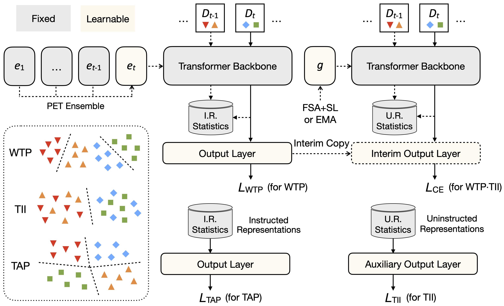

<div align="center">
  
  <div>
  <h1>HiDe-PET: Continual Learning via Hierarchical Decomposition of Parameter-Efficient Tuning</h1>
  </div>
  <div>
      Liyuan Wang&emsp; Jingyi Xie&emsp; Xingxing Zhang&emsp; Hang Su&emsp; Jun Zhu

Dept. of Comp. Sci. & Tech., Institute for AI, BNRist Center, THBI Lab, Tsinghua-Bosch Joint Center for ML, Tsinghua University
  </div>
  <br/>

</div>




The deployment of pre-trained models (PTMs) has greatly advanced the field of continual learning (CL), enabling positive knowledge transfer and resilience to catastrophic forgetting. To sustain these advantages for sequentially arriving tasks, a promising direction involves keeping the pre-trained backbone frozen while employing parameter-efficient tuning (PET) techniques to instruct representation learning. 
Despite the popularity of Prompt-based PET for CL, its empirical design often leads to sub-optimal performance in our evaluation of different PTMs and target tasks.
To this end, we propose a unified framework for CL with PTMs and PET that provides both theoretical and empirical advancements. We first perform an in-depth theoretical analysis of the CL objective in a pre-training context, decomposing it into hierarchical components namely within-task prediction, task-identity inference and task-adaptive prediction. We then present Hierarchical Decomposition PET (HiDe-PET), an innovative approach that explicitly optimizes the decomposed objective through incorporating task-specific and task-shared knowledge via mainstream PET techniques along with efficient recovery of pre-trained representations. Leveraging this framework, we delve into the distinct impacts of implementation strategy, PET technique and PET architecture, as well as adaptive knowledge accumulation amidst pronounced distribution changes. Finally, across various CL scenarios, our approach demonstrates remarkably superior performance over a broad spectrum of recent strong baselines.

## Requirements
- Python 3.6+  
```pip install -r requirements.txt```

## Experimental Setup
Our code has been tested on six datasets: CIFAR-100, ImageNet-R, Cars196, CUB-200, Dogs and FGVC-Aircraft:
### Dataset
- [CIFAR-100](https://www.cs.toronto.edu/~kriz/cifar-100-python.tar.gz)
- [Imagenet-R](https://people.eecs.berkeley.edu/~hendrycks/imagenet-r.tar)
- [CUB-200](https://data.caltech.edu/records/65de6-vp158/files/CUB_200_2011.tgz)
- [Cars196](https://ai.stanford.edu/~jkrause/cars/car_dataset.html)
- [Dogs](http://vision.stanford.edu/aditya86/ImageNetDogs/images.tar)
- [FGVC-Aircraft](https://www.robots.ox.ac.uk/~vgg/data/fgvc-aircraft/archives/fgvc-aircraft-2013b.tar.gz)

### Supervised and Self-supervised Checkpoints
We incorporated the following supervised and self-supervised checkpoints as backbones:
- [Sup-21K VIT](https://storage.googleapis.com/vit_models/imagenet21k/ViT-B_16.npz)
- [iBOT-21K](https://lf3-nlp-opensource.bytetos.com/obj/nlp-opensource/archive/2022/ibot/vitb_16_pt22k/checkpoint.pth)
- [Sup-Weak](https://drive.google.com/drive/folders/1182VgriR841mvW2LXiARTSoBvbPho4Pf)
 
  
Please download the self-supervised checkpoints and put them in the /checkpoints/{checkpoint_name} directory.

## Usage
- **HiDe-Prompt**: if you want to train the continual learning model on Imagenet-R with the ViT-B-16 checkpoint used as the backbone, you can execute the following command:
```
python -m torch.distributed.launch \
       --nproc_per_node=8 \
       --master_port='29500' \
       --use_env main.py \
       imr_continual_prompt \
       --model vit_base_patch16_224 \
       --original_model vit_base_patch16_224 \
       --batch-size 24 \
       --data-path ./datasets \
       --output_dir ./output/imr_vit1k_prompt_fsl_seed42 \
       --seed 42 \
       --epochs 50 \
       --lr 0.03 \
       --ca_lr 0.005 \
       --slow_lr 0.1 \
       --prompt_type continual \
       --continual_type first_sl \
       --num_tasks 10 \
       --dataset Split-Imagenet-R 


python -m torch.distributed.launch \
        --nproc_per_node=8 \
        --master_port='29505' \
        --use_env main.py \
        imr_hideprompt_5e \
        --model vit_base_patch16_224 \
        --original_model vit_base_patch16_224 \
        --batch-size 24 \
        --epochs 50 \
        --data-path ./datasets \
        --ca_lr 0.005 \
        --crct_epochs 30 \
        --seed 42 \
        --prompt_momentum 0.01 \
        --reg 0.001 \
        --length 20 \
        --lr 0.05 \
        --sched cosine \
        --dataset Split-Imagenet-R \
        --larger_prompt_lr \
        --trained_original_model ./output/imr_vit1k_prompt_fsl_seed42 \
        --output_dir ./output/imr_vit1k_pe_seed42 

```

- **HiDe-LoRA**: if you want to train the continual learning model on Imagenet-R with the ViT-B-16 checkpoint used as the backbone, you can execute the following command:
```
python -m torch.distributed.launch \
        --nproc_per_node=8 \
        --master_port='29500' \
        --use_env main.py \
        imr_continual_lora \
        --model vit_base_patch16_224 \
        --original_model vit_base_patch16_224 \
        --batch-size 24 \
        --data-path ./datasets \
        --output_dir ./output/imr_vit1k_lora_fsl_rank5_seed42 \
        --seed 42 \
        --epochs 50 \
        --lr 0.03 \
        --ca_lr 0.005 \
        --slow_lr 0.1 \
        --lora_type continual \
        --continual_type first_sl \
        --num_tasks 10 \
        --lora_rank 5 \
        --dataset Split-Imagenet-R 

python -m torch.distributed.launch \
        --nproc_per_node=8 \
        --master_port='29520' \
        --use_env main.py \
        imr_hidelora \
        --model vit_base_patch16_224 \
        --original_model vit_base_patch16_224 \
        --batch-size 24 \
        --epochs 50 \
        --data-path ./datasets \
        --ca_lr 0.005 \
        --crct_epochs 30 \
        --seed 42 \
        --lr 0.01 \
        --lora_rank 5 \
        --reg 0.001 \
        --sched cosine \
        --dataset Split-Imagenet-R \
        --lora_momentum 0.1 \
        --lora_type hide \
        --trained_original_model ./output/imr_vit1k_lora_fsl_rank5_seed42 \
        --output_dir ./output/cars_vit1k_lora_pe_seed42 

```

- **HiDe-Adapter**: if you want to train the continual learning model on Imagenet-R with the ViT-B-16 checkpoint used as the backbone, you can execute the following command:
```
python -m torch.distributed.launch \
       --nproc_per_node=8 \
       --master_port='29530' \
       --use_env main.py \
       imr_continual_adapter \
       --model vit_base_patch16_224 \
       --original_model vit_base_patch16_224 \
       --batch-size 24 \
       --data-path ./datasets \
       --output_dir ./output/imr_vit1k_adapter_fsl_rank5_seed42 \
       --seed 42 \
       --epochs 50 \
       --lr 0.03 \
       --ca_lr 0.005 \
       --slow_lr 0.01 \
       --adapter_type continual \
       --continual_type first_sl \
       --num_tasks 10 \
       --adapter_rank 5 \
       --dataset Split-Imagenet-R \
       --sched cosine

python -m torch.distributed.launch \
        --nproc_per_node=8 \
        --master_port='29500' \
        --use_env main.py \
        imr_hideadapter \
        --model vit_base_patch16_224 \
        --original_model vit_base_patch16_224 \
        --batch-size 24 \
        --epochs 50 \
        --data-path ./datasets \
        --ca_lr 0.005 \
        --crct_epochs 30 \
        --seed 42 \
        --lr 0.01 \
        --sched cosine \
        --adapter_rank 5 \
        --reg 0.001 \
        --dataset Split-Imagenet-R \
        --adapter_momentum 0.1 \
        --trained_original_model ./output/imr_vit1k_adapter_fsl_rank5_seed42 \

```

- **Few-Shot-LoRA**: if you want to test the few-shot learning ability of up-stream LoRA, you can use the following command:
```
python -m torch.distributed.launch \
        --nproc_per_node=4 \
        --master_port='29500' \
        --use_env fsl.py \
        cub_cars_few_shot_lora \
        --model vit_base_patch16_224 \
        --original_model vit_base_patch16_224 \
        --batch-size 48 \
        --data-path ./datasets \
        --output_dir ./output/ \
        --seed 42 \
        --epochs 50 \
        --lr 0.01 \
        --lora_type hide \
        --fs_backbone vanilla \
        --train_vanilla \
        --vanilla_model_output_dir ./output/4datasets_vit1k_vanilla_model \
        --shared_model_output_dir ./output/4datasets_vit1k_shared_model \
        --lora_rank 5 \
        --num_tasks 20

python -m torch.distributed.launch \
        --nproc_per_node=4 \
        --master_port='29500' \
        --use_env fsl.py \
        cub_cars_few_shot_lora \
        --model vit_base_patch16_224 \
        --original_model vit_base_patch16_224 \
        --batch-size 48 \
        --data-path ./datasets \
        --output_dir ./output/ \
        --seed 42 \
        --epochs 50 \
        --lr 0.01 \
        --lora_type hide \
        --fs_backbone shared \
        --train_shared \
        --vanilla_model_output_dir ./output/4datasets_vit1k_vanilla_model \
        --shared_model_output_dir ./output/4datasets_vit1k_shared_model \
        --lora_rank 5 \
        --num_tasks 20

for start in {100..180..20};
do
end=$((start + 19))
class_idxs=$(seq -s " " $start $end)
echo "Running with class indexes: $class_idxs"
python -m torch.distributed.launch \
        --nproc_per_node=1 \
        --master_port='29513' \
        --use_env fsl.py \
        cub_cars_few_shot_lora \
        --model vit_base_patch16_224 \
        --original_model vit_base_patch16_224 \
        --batch-size 24 \
        --data-path ./datasets \
        --output_dir ./output/ \
        --seed 42 \
        --epochs 50 \
        --lr 0.01 \
        --lora_type hide \
        --num_tasks 20 \
        --num_fs_epochs 50 \
        --num_shots 5 \
        --train_few_shot \
        --fs_backbone vanilla+shared \
        --num_episodes 100 \
        --vanilla_model_output_dir ./output/4datasets_vit1k_vanilla_model \
        --shared_model_output_dir ./output/4datasets_vit1k_shared_model \
        --lora_rank 5 \
        --num_ways 20 \
        --few_shot_dataset_idx 3 \
        --few_class_idx $class_idxs
done

```

## Acknowledgement
This repository is developed mainly based on the PyTorch implementation of [Dual-Prompt](https://github.com/JH-LEE-KR/dualprompt-pytorch). Many thanks to its contributors!

## **Citation**

If you find this code helpful to your work, please cite our paper:

```bibtex
@article{wang2024hide,
  title={HiDe-PET: Continual Learning via Hierarchical Decomposition of Parameter-Efficient Tuning},
  author={Wang, Liyuan and Xie, Jingyi and Zhang, Xingxing and Su, Hang and Zhu, Jun},
  journal={arXiv preprint arXiv:2407.05229},
  year={2024}
}
```

